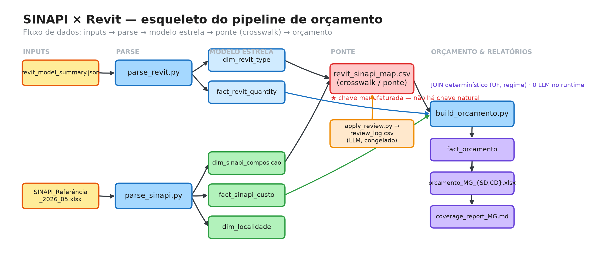

# SINAPI ↔ Revit orçamento pipeline

Ties a Revit BIM quantity takeoff (`revit_model_summary.json`, project *CÂMARA MUNICIPAL*) to
SINAPI 2026-05 unit costs to produce a cost estimate (orçamento) for **Minas Gerais (MG)**.

## Esquema do projeto



Fonte editável: [`docs/esqueleto_projeto.excalidraw`](docs/esqueleto_projeto.excalidraw)
(abrir em [excalidraw.com](https://excalidraw.com)). Regenerar com
`python3 src/make_diagram_png.py` (PNG) e `python3 src/make_excalidraw.py` (fonte).

## Model (relational / star schema)

There is **no natural key** between Revit and SINAPI (Revit type/material is authored free text;
SINAPI codes are a government catalog). The connection is a **manufactured conformed crosswalk
(bridge) dimension** — `crosswalk/revit_sinapi_map.csv` — built once, reviewed, and frozen. The
costing is then a pure deterministic join; no LLM in the runtime, same inputs ⇒ identical output.

```
dim_revit_type ──┐
                 ├─ map_revit_to_sinapi (bridge) ── dim_sinapi_composicao
fact_revit_quantity ┘                    │
                                 fact_sinapi_custo (uf, regime)  ──► fact_orcamento
```

## Outputs are regenerated on demand

The orçamento deliverables (`output/fact_orcamento_*.parquet`, `output/orcamento_*.xlsx`,
`output/coverage_report_*.md`) are **gitignored** — they reproduce byte-for-byte from source, so
they don't live in git. Rebuild them locally with the `Makefile`:

```bash
make regen     # crosswalk + all orçamentos/coverage (MG: SD CD SE) -> output/
make verify    # assert everything reproduces deterministically (hash gate)
make clean     # delete the regenerable outputs from output/
```

`make regen` assumes `data/*.parquet` (from `parse_sinapi.py`) and `revit_model_summary.json` are
present locally; both are gitignored raw inputs. Override the matrix with `make regen UF=MG
REGIMES="SD CD"`.

## Run order (what `make regen` does, plus the one-time SINAPI parse)

```bash
python3 src/parse_sinapi.py            # 1. tidy SINAPI xlsx  -> data/*.parquet  (one-time per SINAPI month; not in `make regen`)
python3 src/parse_revit.py             # 2. flatten Revit JSON -> data/dim_revit_type, fact_revit_quantity
python3 src/build_crosswalk.py         # 3. unit-gate + grupo-anchor + thickness + fuzzy -> crosswalk CSV
python3 src/apply_review.py            # 3b. frozen LLM-review overrides + explicit gaps (idempotent)
python3 src/build_orcamento.py --uf MG --regime SD   # 4. deterministic costing join -> output/*.xlsx
python3 src/coverage_report.py --uf MG --regime SD   # 5. coverage / confidence / gaps report
```

`--regime` ∈ {SD = Sem Desoneração, CD = Com Desoneração, SE = Sem Encargos}. Switching regime
changes only the costs, never the mapping.

## Enable the determinism hook (per clone)

A pre-commit hook guards the project's core invariant: `crosswalk/revit_sinapi_map.csv` must always
reproduce from source. Git doesn't activate committed hooks automatically, so enable it **once in
each clone**:

```bash
git config core.hooksPath .githooks
```

Once enabled, any commit that stages `crosswalk/revit_sinapi_map.csv` runs the hash gate
(`tools/hash_gate.py`) and is rejected if the staged file doesn't rebuild from source. Commits that
don't touch the crosswalk are not gated, and the hook auto-skips on machines without the raw inputs
(`data/*.parquet`, `revit_model_summary.json`). Run it manually any time with `make verify`.

## Matching logic (deterministic)

1. **Unit gate** — a Revit type priced in M2/M/UN only matches SINAPI composições of the same unidade.
2. **Grupo anchor** — each Revit group is restricted to its allowed SINAPI `grupo`(s).
3. **Thickness anchor** (alvenaria) — wall `thickness_m` → block width (9/14/19 cm), since wall
   type names carry only the finish, not the block.
4. **Fuzzy rank** — rapidfuzz token_set_ratio within the bounded pool; ties broken by lowest código.
5. **Review pass** (`apply_review.py`) — frozen reviewer decisions promote/correct flagged rows and
   mark true gaps; every decision is logged in `crosswalk/review_log.csv`.

## Current results (MG, SINAPI 2026-05)

| regime | grand total |
|---|---|
| Sem Desoneração | R$ 1,832,530.69 |
| Com Desoneração | R$ 1,802,493.73 |

Confidence: 45 high · 125 medium (anchored) · 4 low · **12 explicit gaps** (priced manually — see
coverage report: calha de cobertura, portões, divisórias de granito/naval, pele de vidro, laje aparente).

## Known limitations
- Revit walls describe finish, not block; alvenaria is thickness-anchored, not spec-matched.
- Wall finish areas use the model's single computed face area (verify if both faces needed).
- SINAPI 2026-05 has no roof-gutter (calha) composição; gates exist only per M² — both flagged as gaps.
